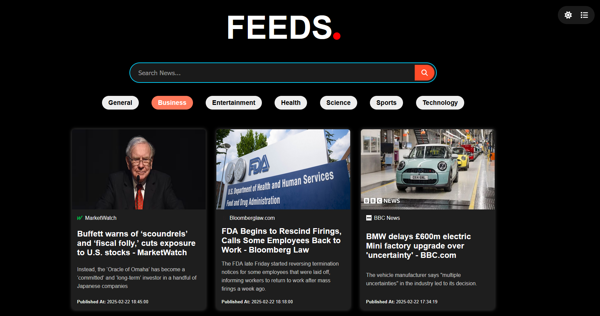
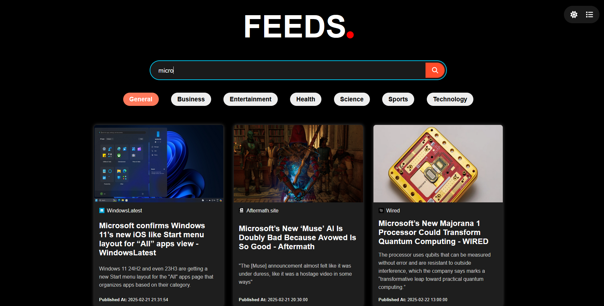

# Feeds App 📰

Feeds is a dynamic, user-friendly web application designed to provide users with a highly customizable and interactive news reading experience. With its responsive design and intuitive features, Feeds ensures users stay informed on the latest news anytime and anywhere.

---

## **Table of Contents** 📋

1. [Overview](#overview)
2. [Features](#features)
   - [Search Functionality](#search-functionality)
   - [Categories Feature](#categories-feature)
   - [Options Menu](#options-menu)
3. [How to Use](#how-to-use)
4. [API Integration](#api-integration)
5. [Screenshots Overview 🖼](#screenshots-overview-)
6. [Tech Stack 🛠](#tech-stack-)
7. [How to Run the App 🚀](#how-to-run-the-app-)

---

## **Overview**
Feeds is designed to provide streamlined access to a wide range of news articles. Users can:
- Search, filter, and manage news consumption effectively.
- Customize their experience with layout and theme options.
- Navigate seamlessly through categories and reset the app easily.

---

## **Features**

### **Search Functionality**
- **App Search:** Instantly retrieves articles within the app as the user types.
- **Deep Search:** Fetches articles from the past few weeks based on user input, accessible via the search icon.

### **Categories Feature**
- Browse news articles filtered by specific categories (e.g., Business, Entertainment, Technology).

### **Options Menu**
- **Dark Mode:** Saves user preferences in local storage for consistent theme usage.
- **Layout Options:** Switch between different article display layouts for a tailored reading experience.

---

## **How to Use**

### **Starting a Search**
- **App Search:** Begin typing in the search bar to see matching articles from within the app.
- **Deep Search:** Click the search icon to perform a deeper search fetching older articles.

### **Viewing Articles by Category**
- Use category buttons to filter the feed by topics like Business, Entertainment, and Technology.

### **Customizing the Experience**
- Toggle between dark and light modes via the options menu.
- Change article layouts for a personalized viewing experience.

### **Navigating the App**
- Use the app title or the "General" category button to reset to the home view.
- Category buttons provide quick navigation without reloading the page.

---

## **API Integration**
Feeds uses the [News API](https://newsapi.org) to fetch fresh and relevant articles.  
- The free version has a daily limit of 100 requests.

---

## **Screenshots Overview 🖼**

### **Home View**

### **Categories View**

### **Search View**

### **Full Search View**

### **Alternate Layout View**

### **Dark Mode View**

---

## **Tech Stack 🛠**
- **Frontend:** React (Create React App)
- **API:** [News API](https://newsapi.org)

---

## **How to Run the App 🚀**

1. Clone the repository:
- git clone https://github.com/obrito00/NewsFeedsApp
- cd NewsFeedsApp

2. Install dependencies:
npm install

3. Obtain the API key from newsapi.org:
- create the .env file
- Add: REACT_APP_API_KEY=your_api_key

4. Start the App:
npm start
